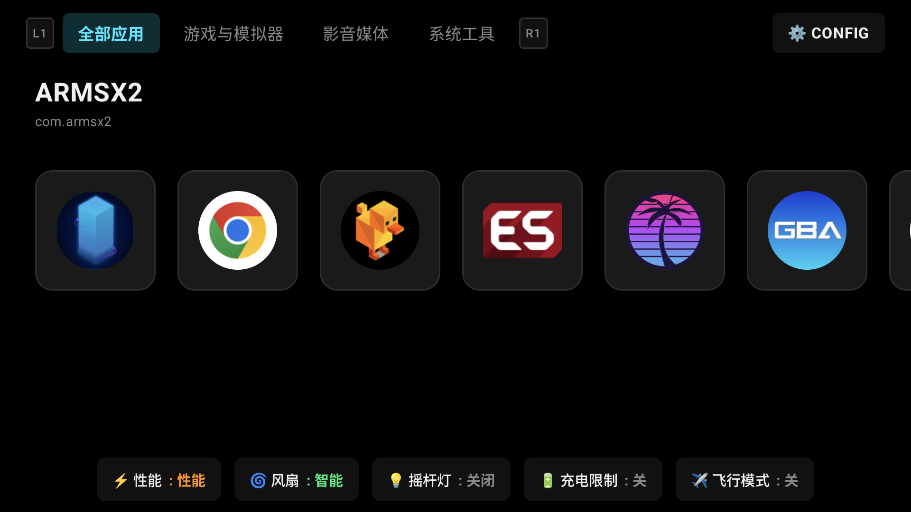
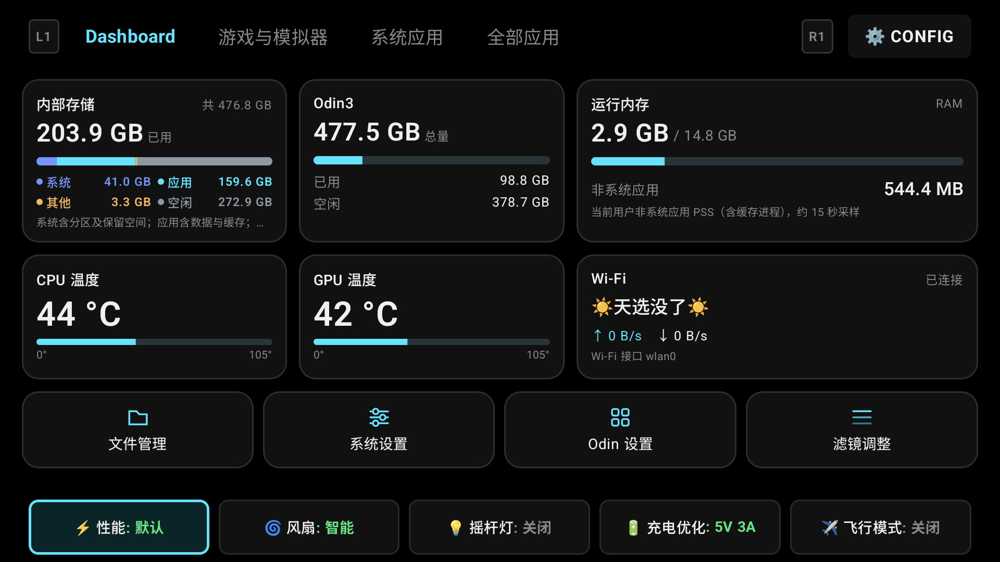
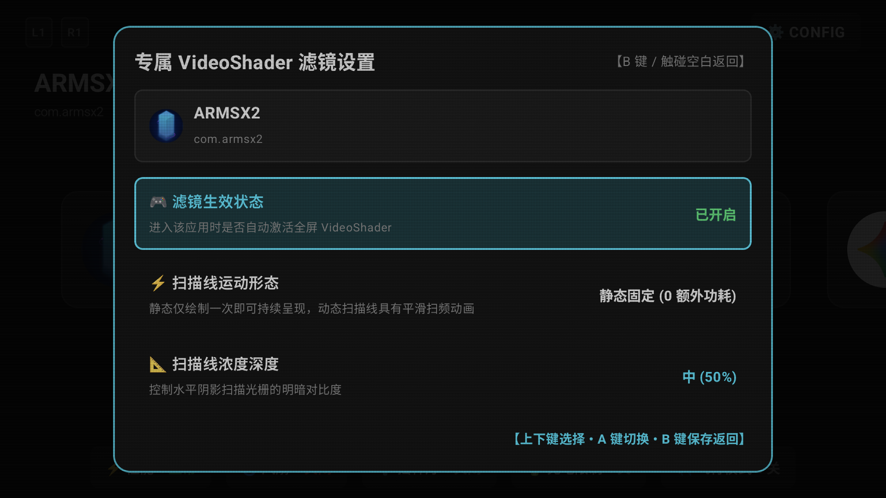
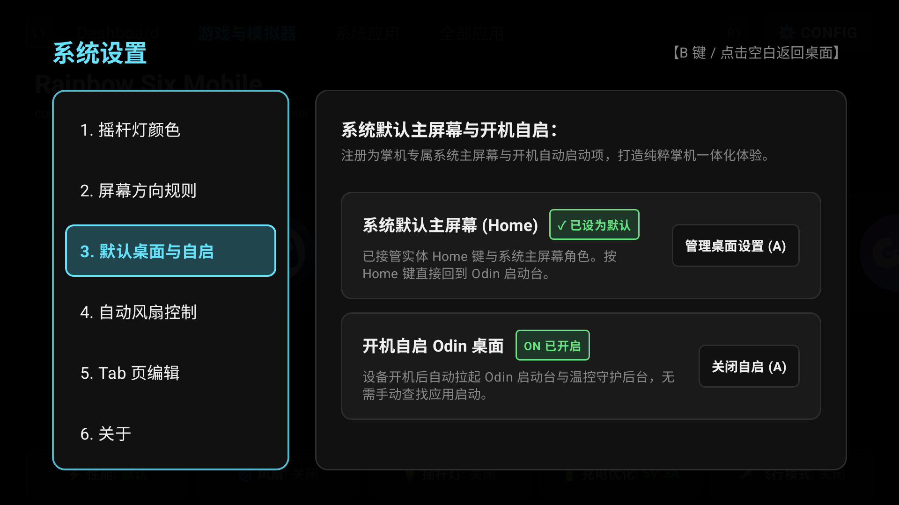
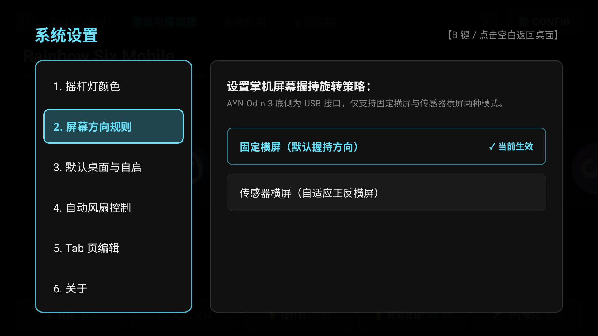
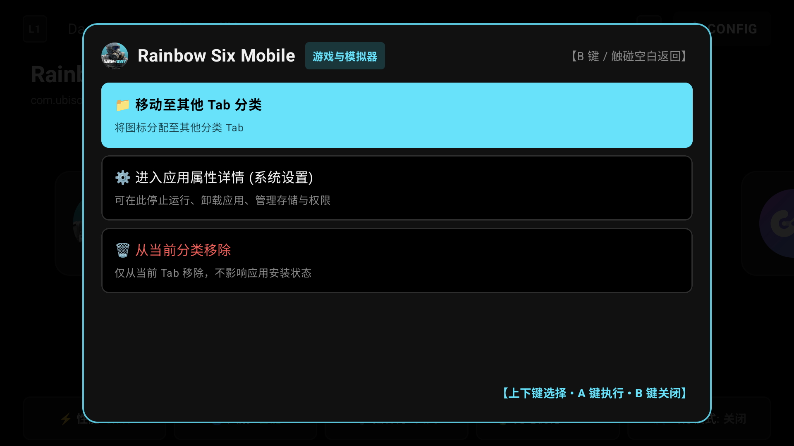
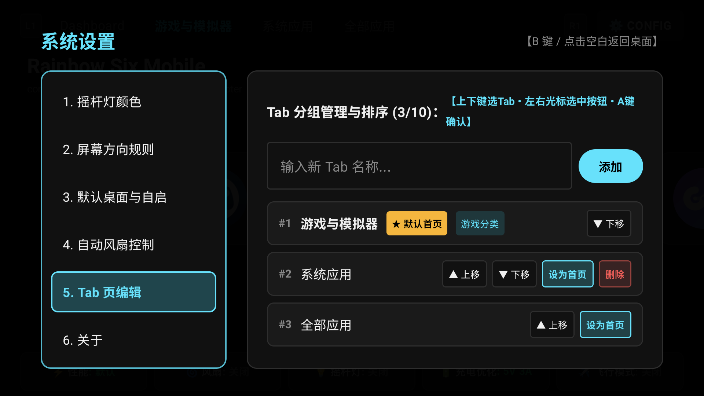
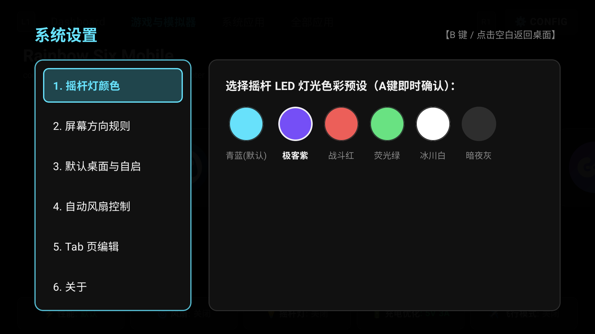

# 🎮 Odin 3 Desktop (`odin3-desktop`)

<div align="center">

**专为 AYN Odin 3 安卓掌机深度打造的旗舰级默认桌面启动台与系统增强套件**

[](https://github.com/LeXwDeX/odin3-desktop/releases)
[-black?style=for-the-badge&logo=qualcomm)](https://github.com/LeXwDeX/odin3-desktop)
[](https://github.com/LeXwDeX/odin3-desktop)
[](https://github.com/LeXwDeX/odin3-desktop)

*纯粹掌机美学 • 100% 全实体手柄盲操 • 系统级默认主屏幕与开机自启 • TVGAME 电视画面校准台 • 智能温控风扇调度*

</div>

当前开发交接见 [性能、风扇与 Home/返回键修复记录](docs/performance-fan-home-fixes.md)。其中包含新机器 clone 后的构建步骤、已验证结果及设备重连后的待验项目。

首版已接入简体中文与英文资源，默认跟随系统语言；Android 13+ 同时声明系统应用语言列表。分类身份与显示名称分离，自定义名称保持原样。架构调整、扩展接口和本地验证范围见 [架构审计与首版扩展接口](docs/architecture.md)。下方截图来自此前实机版本，本轮多语言排版尚待设备重连验证。

---

## 📸 掌机视觉画册 (Showcase)

### 1. 极致纯黑 OLED 掌机桌面 (Console Home)
采用全对称中轴线视网膜大卡片滑带设计，背景深度适配 Odin 3 AMOLED 屏幕纯黑低功耗特性（`#000000`）。支持毫秒级手柄摇杆光标跟随与触控操作 100% 绝对同频同步。



---

### 2. 仪表盘与设备状态中心 (Dashboard)
首页最左侧的只读硬件状态与快捷操作中心。存储与 CPU/GPU 组合对齐，运行内存与 Wi-Fi 对齐：
* **内部存储 4 色分类标定**：采用 4 色独立进度条与字色标识，直观呈现空间结构：
  - 🔵 **系统空间**（`#7C4DFF` 紫蓝）：Android 系统分区及保留空间；
  - 🟢 **应用安装**（`#00E676` 翡翠绿）：用户应用及其数据文件；
  - 🟡 **其他文件**（`#FFB300` 琥珀黄）：下载、媒体与文档等其他已用数据；
  - ⚪ **空闲容量**（`#455A64` 幽灵灰）：剩余可用空间；
* **外部扩展卷**：自动枚举并展示 TF 卡卷独立容量卡片；
* **实时硬件传感器**：只读采集 CPU/GPU 物理最高温度（0~105°C 动态标度）、非系统应用 PSS 内存占用、Wi-Fi 吞吐速率；
* **四项常用操作**：文件管理（DocumentsUI）、系统设置、Odin 设置、滤镜调整；
* **五项硬件 Dock**：性能模式、风扇调度、摇杆氛围灯、充电优化、飞行模式。



---

### 3. TVGAME 电视画面校准台 (TV Display Calibration OSD)
专为掌机复古游戏打造的特丽珑/PVM 监视器风格实时校准工具，可通过 Dashboard 常用操作【滤镜调整】或下拉通知栏磁贴长按即刻唤出：
* **广播级测试信号源**：内置 75% SMPTE 标准彩条标定信号、几何交叉安全框网格（Crosshatch）、240p 复古像素游戏场景、游戏原生画面截图；
* **灰阶标定基准块**：集成 `04% 隐约`（暗部黑电平）、`50% 基准`（中灰伽马）、`96% 清晰`（高光对比度）标定基准，复刻专业调机流程；
* **经典图像预设**：特丽珑 CRT、复古街机、鲜艳游戏、高清 FXAA、纯净原画、自定义（已彻底移除 NTSC 杂波）；
* **实时硬件级参数调节**：对比度、亮度、色彩伽马、CRT 显像管扫描线、FSR 硬件锐化、Vivid 鲜艳色彩增强、FXAA 抗锯齿；
* **全手柄沉浸盲操**：D-Pad 上下选条目、左右 **0ms 实时无级微调**，L1/R1 切换预设，**按住 X 瞬时原画对比**，**Y 键一键隐藏菜单全屏沉浸**，B 键保存并退出。



---

### 4. 系统级默认主屏幕与开机自启 (Default Home & Boot Startup)
深度融入 Android 系统底层角色与电源生命周期：
* **合规系统默认桌面**：具备标准 `android.app.role.HOME` 与 `CATEGORY_HOME` 声明，按下 Odin 3 **实体 Home 键**瞬间直达本启动台；
* **开机自动拉起**：注册 `BOOT_COMPLETED`、`LOCKED_BOOT_COMPLETED` 与高通高优先级 `QUICKBOOT_POWERON`，开机自启后台温控守护并直接拉起桌面界面；
* **控制台一键管理**：在设置【3. 默认桌面与自启】中实时探测桌面角色状态，按 A 键一键申请系统角色或管理默认应用，开机自启开关支持随时一键切换。



---

### 5. 屏幕方向规则系统级生效 (Orientation Rules)
彻底修复普通应用无法全局横屏的缺陷，打通系统级防翻转机制：
* **固定横屏（默认握持方向）**：写入系统 `force_landscape = 1` 触发 Odin 3 OEM 系统服务启动顶层防翻转横屏浮层，全局拦截并纠正所有第三方应用为横屏；同步关闭系统自动翻转并锁定横屏方向；
* **传感器横屏（自适应正反横屏）**：解除强制横屏并开启重力传感器自适应翻转；
* 系统重启与冷启动自动持久化生效。



---

### 6. 应用专属操作控制台 (App Actions)
在桌面卡片对着任意应用按下手柄 `Y` 键即刻呼出控制台级操作浮层：
* **移动至其他 Tab 分类**：无损将图标迁移至其他自定义分组；
* **进入应用属性详情**：一键直达系统设置应用详情页（管理权限、存储与安全卸载）；
* **从当前分类移除**：从当前 Tab 移出图标（不影响应用本身安装）。



---

### 7. 模块化 Tab 自定义分组编辑 (Tab Management)
彻底告别乱糟糟的手机式应用抽屉。为掌机用户量身打造分组管理体系：
* 支持自由创建新分组、修改名称、标记为「游戏分类」；
* 支持手柄光标快速调整分组显示顺序（上移/下移）；
* 支持指定任意分组为「默认首页」；
* 在应用列表界面长按 `X` 键支持全量应用快速检索与批量勾选归类。



---

### 8. 摇杆 RGB LED 氛围灯 (LED Customization)
提供 6 种经过色彩校准的摇杆 LED 氛围灯预设（青蓝、极客紫、战斗红、荧光绿、冰川白、暗夜灰）：
* 手柄光标左右切换，按 A 键即时生效并写入硬件；
* 优化响应管线，极速触发，受限硬件后端双向安全读回确认。



---

## 🎨 设计哲学与色彩体系 (Design Philosophy)

系统统一遵循直观严谨的掌机状态色彩层级：

| 色彩定义 | 状态含义 | 典型应用场景 |
| :--- | :--- | :--- |
| **幽灵灰 (`#757575`)** | **关闭 / OFF / 空闲** | 功能关闭、开关处于 OFF 状态、磁盘空闲空间 |
| **翡翠绿 (`#00E676`)** | **安全 / 开启 / 正常** | 功能正常启用、开机自启 ON、性能默认档、应用已安装占用 |
| **琥珀黄 (`#FFD54F`)** | **警告 / 中度性能** | 性能模式、9V/3A 充电模式、未设为默认主屏幕 |
| **战斗红 (`#FF5252`)** | **最高 / 严重 / 极限** | 高性能模式、风扇最大档、充电分离激活 |
| **电光蓝 (`#00E5FF`)** | **特殊状态 / 高亮聚焦** | 充电风扇静音生效时的特殊停转状态、当前手柄光标聚焦 |

### 防抖与 0ms 极速手感
针对掌机手柄高频连续按键场景，底层采用**乐观更新 (Optimistic UI) + 协程防抖通道 (Debounce & Coalesce)**。连续点击时界面 0ms 瞬间翻转响应，后台硬件控制指令聚合平滑下发，彻底消除界面反复闪烁与回跳。

---

## 🕹️ 全硬件实体按键交互指南 (Gamepad Controls)

| 按键 / 组合 | 触发场景 | 交互行为 |
| :--- | :--- | :--- |
| **D-Pad / 摇杆 (左右)** | 桌面大卡片 | 在应用卡片之间水平平滑循环导航，带弹性视网膜动效 |
| **D-Pad / 摇杆 (上下)** | 桌面主层 | 在顶部 Tab 栏、中部应用区/常用操作、底部 Dock 之间移动焦点 |
| **L1 / R1** | 桌面主层 | 向左 / 向右循环切换 Dashboard 与各个应用 Tab 分组 |
| **A 键 (确认)** | 全局通用 | 启动选中应用；执行菜单选项；循环 Dock 硬件状态；确认设置项 |
| **B 键 (返回)** | 全局通用 | 退出当前操作弹窗；取消排序；从设置子菜单返回左侧导航 |
| **X 键** | 桌面卡片区 | 呼出当前 Tab 的**批量增删应用抽屉**（支持全拼/首字母即时搜索与勾选） |
| **X 键** | Dock 风扇卡片 | 切换**充电风扇静音模式**（开启时显示蓝色“关闭”） |
| **X 键** | Dock 充电卡片 | 切换**充电分离模式**（开启红 / 关闭灰） |
| **Y 键 (长按/按键)** | 桌面卡片区 | 呼出**应用专属操作菜单**（Tab 迁移、系统属性、移除图标） |
| **Y 键 (短按)** | 桌面卡片区 | 开启/退出当前分类卡片的手动自由排序模式 |
| **Home 键** | 系统任何位置 | 实体物理按键直接返回 Odin 启动台 |
| **D-Pad (上下)** | TVGAME 校准台 | 在 OSD 校准菜单各项参数之间移动光标 |
| **D-Pad (左右)** | TVGAME 校准台 | **0ms 实时微调**当前选中的对比度、亮度、伽马、锐化等参数 |
| **L1 / R1** | TVGAME 校准台 | 快速循环切换 6 大图像预设 |
| **按住 X 键** | TVGAME 校准台 | **瞬时原画对比 (Bypass)**：按住时直通纯净原画，松手瞬间恢复调校效果 |
| **Y 键** | TVGAME 校准台 | **全屏沉浸切换**：一键隐藏/唤起 OSD 菜单，纯享全屏标定画面 |

---

## ⚡ 核心技术架构 (Architecture Highlights)

```
odin3_desktop/
├── app/src/main/
│   ├── AndroidManifest.xml     # HOME Launcher、开机广播与 QS 磁贴核心声明
│   ├── java/com/odin/desktop/
│   │   ├── OdinDesktopApplication.kt   # 全局单例与 Room 数据库初始化
│   │   ├── dashboard/                  # 只读统计、存储多卷探测与四项常用操作
│   │   ├── data/                       # Room 数据库实体、DAO 与多源数据仓库
│   │   ├── receiver/                   # BootCompletedReceiver 开机多广播与自启拉起
│   │   ├── service/
│   │   │   ├── afk/                    # 息屏挂机 OLED 纯黑防烧屏浮层服务
│   │   │   └── fan/                    # 温控守护服务、无障碍前台感知、HardwareController
│   │   ├── shader/
│   │   │   ├── control/                # ShaderControlActivity 独立校准台 Activity
│   │   │   ├── engine/                 # VideoShaderEngine 掌机生命周期渲染中心
│   │   │   ├── preview/                # TvTestPatternGenerator 广播级彩条与测试图案
│   │   │   └── runtime/                # AGSL 着色器运行时管线
│   │   └── ui/
│   │       ├── MainActivity.kt         # 默认桌面主入口、沉浸式全屏与按键路由
│   │       ├── components/             # BottomDockBar、DashboardContent、ConfigDialog、TopTabBar
│   │       ├── navigation/             # FocusZone 掌机绝对焦点管理器与 GamepadKeyHandler
│   │       ├── screens/                # LauncherScreen 顶级响应式组合布局
│   │       ├── theme/                  # 纯黑 OLED 主题色彩体系
│   │       └── viewmodel/              # LauncherViewModel 状态机与硬件控制聚合通道
│   └── res/
└── tools/hardware-bridge/              # 受限 ADB 硬件通信桥接组件与自检套件
```

* **Android 13+ & Jetpack Compose**：专为 AYN Odin 3 掌机横屏高刷 OLED 定制，全矢量硬件加速渲染；
* **双向安全硬件桥**：受限 ADB 桥仅监听 `127.0.0.1:18889` 本地回环，严格白名单鉴权，无 root 依赖保障设备安全；
* **纯黑 OLED 保护**：全界面 `#000000` 像素发光优化，息屏挂机浮层配合微位移防烧屏引擎。

---

## 📦 编译构建与安装部署 (Build & Install)

### 环境要求
* OpenJDK 17
* Android SDK (API 35 / Build-Tools 35.0.0)
* AYN Odin 3 掌机设备 (开启 USB 调试)

### 本地编译与安装
```bash
# 1. 进入工程目录
cd odin3_desktop

# 2. 编译生成 Debug APK
export JAVA_HOME=/opt/homebrew/opt/openjdk@17
export ANDROID_HOME=/opt/homebrew/share/android-commandlinetools
./gradlew assembleDebug

# 3. 安装到已连接的 Odin 3 掌机
adb install -r app/build/outputs/apk/debug/app-debug.apk

# 4. 启动启动台
adb shell am start -n com.odin.desktop/.ui.MainActivity
```

---

## 📜 许可与致谢 (Credits & License)

* **GameNative & Winlator**：感谢复古游戏开源社区对于 CRT 着色器渲染算法的卓越贡献；
* **AYN Odin 社区**：专为追求极致纯粹安卓掌机体验的硬核玩家打造。

第三方 Shader 来源与许可见 [THIRD_PARTY_NOTICES](THIRD_PARTY_NOTICES.md)。仓库尚未包含第一方代码的统一 LICENSE 文本。
