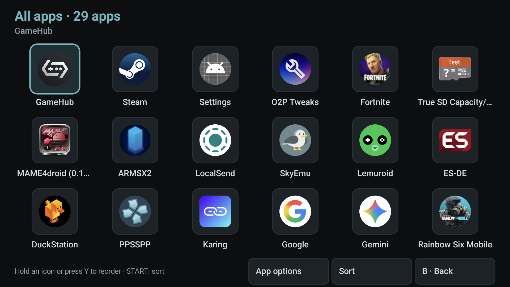
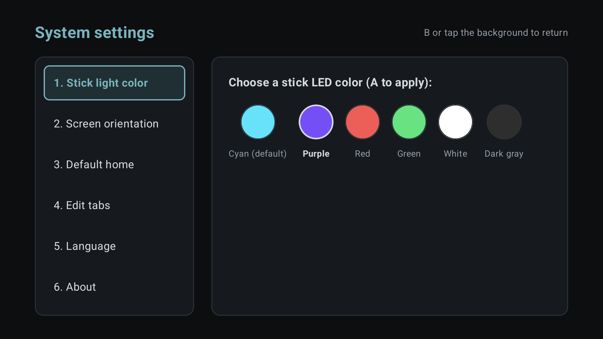
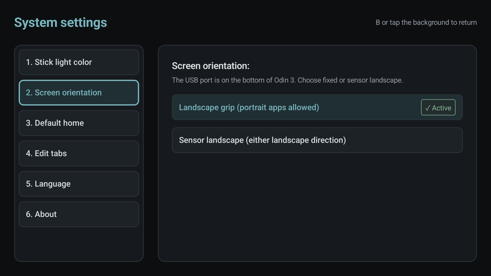

# Odin 3 Desktop

A controller-friendly Android launcher for the **AYN Odin 3**, with a soft dark interface, app groups, a full-screen app library, and direct access to the handheld's hardware controls.

[](https://github.com/LeXwDeX/odin3-desktop/releases/latest)
[](https://github.com/LeXwDeX/odin3-desktop/actions/workflows/android-ci.yml)
[](https://developer.android.com/compose)

[Download the APK](https://github.com/LeXwDeX/odin3-desktop/releases/latest) · [Report a bug or request a feature](https://github.com/LeXwDeX/odin3-desktop/issues)



## Getting started

1. Download the APK from the [latest release](https://github.com/LeXwDeX/odin3-desktop/releases/latest) and install it on your Odin 3.
2. Open Odin Desktop. To use it as your home screen, go to **Settings → 3. Default home** and choose it in the Android system dialog.
3. Choose your language in **Settings → 5. Language**. English, Chinese, and Japanese are available; the default follows the system, with English as the fallback.

Hardware controls work through the Odin firmware's built-in service. Normal use does **not** require root, a computer, wireless debugging, or a separately started ADB bridge. Updating with an APK signed by the same key preserves your app data and groups.

The app targets the AYN Odin 3. Hardware integration has been verified on Android 15 with firmware `Odin3_V1.0.0.187_20260616_193307_user`. The APK supports Android 10 and later, but compatibility with other devices or firmware is not established.

## Home screen and app library

Each group's home row shows up to **10 apps**. When the group contains more than 10, the next tile is **[+]**. Open it to see **every app in that group**, including the first 10. The page title shows the group's name and app count. Opening [+] in the **All apps** group shows every installed, launchable app.

The library fills the screen: no tab bar and no hardware dock. Navigate with the D-pad or stick, scroll by touch, and press **B** to return to the original group and its [+] tile. On the Odin 3 at its default display and font settings, the grid shows three rows of six icons. The column count adapts to the available width.

Android status and navigation bars stay hidden while using the launcher, including after unlocking or returning from another app. Swipe from a screen edge to reveal them temporarily.

The interface uses a soft dark palette with clear information colors: cyan marks focus, green/orange/red distinguish control states, and storage bars share their colors with the corresponding labels. Internal storage and SD cards use the same gray for free space.

App names can be shortened in the grid; the selected app's name also appears above it. Installed apps supply their own icons and names. No games, ROMs, or emulators are bundled.

### Organizing apps

- Create up to 10 groups in **Settings → 4. Edit tabs**. Use **▲ / ▼** to move a group, choose its default-home action, or delete an eligible group.
- Group names and actions have separate rows so longer translations do not compete for the same horizontal space. Saved group names keep their original text and capitalization when changing languages, including names inherited from older versions. System entries such as **All apps** still follow the interface language.
- Press **X** in an app group to open its searchable membership list. Adding or removing a group entry does not install or uninstall the app.
- Press **Y** or hold an icon to reorder. Pick an icon and tap its destination, or drag it toward an edge to scroll. Reordering exposes the complete group, including apps beyond the first 10.
- Press **START** or tap **Sort** to choose manual order, installation time, last used, or app name. Sort preferences are saved separately for each group.

Installation order uses the original install time, so updating an app does not move it to the front. Last-used order requires Android usage access; apps without a usage record appear after those with a record. Each group's full-screen page shares that group's saved order, sorting preference, and app membership.

## Hardware dock

The home screen provides five controls: performance, fan, stick lights, charging, and airplane mode. English and Japanese use compact status labels; full localized descriptions remain available to accessibility services.

| Control | Labels | Meaning |
| --- | --- | --- |
| Performance | `P1` / `P2` / `P3` | Normal / Performance / Maximum |
| Fan | `OFF` / `S` / `M` | Off / Smart / Maximum |
| Stick lights | `ON` / `OFF` | Enable or disable the lights |
| Charging | `5V 3A` / `9V 3A` | Charging power selection |
| Charging bypass | `5V BP` / `9V BP` | Bypass enabled at the selected voltage |
| Airplane mode | `ON` / `OFF` | Enable or disable airplane mode |

The fan can also report `Q` for Quiet or `SYS` for another firmware mode. An unavailable reading uses `—`. Performance labels use `P` to distinguish them from the **L1 / R1** shoulder buttons.

**Smart fan mode belongs to the firmware.** Odin Desktop has no automatic fan policy or fan watchdog. It does not change fan modes in response to charging, sleep, temperature, or the foreground game. A user-initiated performance change retains the existing cooling coordination: Maximum fan stays selected; other modes use Off with Normal performance and Smart with higher performance levels.

The firmware's USB charging fan option is separate. On the verified firmware, it is under **Odin settings → USB settings**. Its charging behavior can override an earlier manual fan selection. Installing or updating this launcher does not change that option or disable firmware thermal protection.

## Dashboard

The Dashboard shows internal-storage categories, mounted external-storage capacity, CPU and GPU temperature, memory usage, and Wi-Fi throughput. It also provides shortcuts to Files, Android settings, and Odin settings.

Entering the Dashboard starts a sample immediately. Each sampler then refreshes at **6-second intervals three times**, followed by **30-second intervals**. Leaving the Dashboard or hiding the launcher stops collection; returning starts the initial cadence again. Slow queries complete before another sample is requested, so work does not accumulate. The smaller battery and fan display in the home-screen header has its own refresh schedule.

Statistics that cannot be read are marked unavailable. Usage access is needed for some storage and memory details. The launcher avoids presenting incomplete app-memory totals as complete measurements.

Free space uses the same gray in both internal and external storage bars. When no external volume is detected, the internal storage card fills the storage row; changes appear on the next Dashboard refresh.

## Settings

### Stick lights

Choose from six color presets with touch or the controller. The focused preset is applied with **A**.



### Orientation

**Landscape grip** keeps landscape apps in the normal handheld orientation while allowing apps that explicitly request portrait. **Sensor landscape** releases that preference and follows the app's orientation request and the device sensors. Settings are applied through the firmware and read back; no persistent rotation service is needed.



### Default home and background behavior

Android remains responsible for choosing the default home app. If you select another launcher, Odin Desktop does not try to bring itself to the foreground at boot.

Hardware buttons do not require a persistent foreground service. The optional AFK black-screen overlay runs only when explicitly enabled. Double-tap to exit it, or press Power to put the device to sleep; sleeping ends the overlay, notification, and wake lock. Waking the device does not automatically restart AFK mode.

The screenshots above are captured from the English interface of v0.1.10 on a physical Odin 3.

## Controller guide

| Input | Action |
| --- | --- |
| D-pad / stick | Move between apps, controls, and menu options; navigate the library in four directions |
| L1 / R1 | Switch between Dashboard and app groups on the home screen |
| A | Launch the selected app, confirm an action, or cycle a dock control |
| B | Go back; close the library and restore its source position |
| X in an app group | Open the app membership manager |
| X on the charging control | Toggle charging bypass |
| Y | Enter or finish manual icon reordering |
| Hold Y / App options | Open actions for the selected app |
| START / Sort | Open the sort menu |
| Home | Return to the launcher selected by Android |

While reordering, B first puts down a picked-up icon, then exits reorder mode. A further B closes the library. Open dialogs also handle B before the page behind them. Shoulder buttons do not switch hidden tabs inside the full-screen library.

## Build from source

Use **JDK 17**, **Android SDK 35**, and the Gradle Wrapper. The project includes a setup helper for Apple Silicon macOS; its SDK, JDK, caches, and local signing files stay in ignored directories.

```sh
git clone https://github.com/LeXwDeX/odin3-desktop.git
cd odin3-desktop
python3 tools/setup-android.py
tools/android ./gradlew -PreleaseVersion=0.1.11 :app:assembleDebug
```

For other environments, configure `JAVA_HOME` and `ANDROID_HOME`, then run the Gradle Wrapper directly. A locally generated debug key may differ from the release key; keep the original signing key when you need an in-place update.

Run the main checks with:

```sh
tools/android ./gradlew :app:testDebugUnitTest :app:assembleRelease :app:lintDebug
tools/android python3 tools/architecture-regression.py
tools/android python3 tools/home-back-regression.py
```

The app uses Kotlin, Jetpack Compose, Room, and coroutines. GitHub Actions builds and checks changes; version tags produce signed release APKs with SHA-256 checksum files.

Further developer notes are currently in Chinese: [development and device validation](docs/development.md), [releases and signing](docs/releases.md), [app ordering](docs/icon-ordering.md), [localization](docs/languages.md), and [hardware integration](docs/hardware-standalone-investigation.md).

## Feedback and licensing

Please include your app version, Odin firmware, language, display/font size, and reproduction steps when [reporting an issue](https://github.com/LeXwDeX/odin3-desktop/issues). A screenshot helps with layout issues.

This is a community project and is not an official AYN launcher. The repository does not currently include a unified first-party LICENSE file. Third-party notices are in [THIRD_PARTY_NOTICES.md](THIRD_PARTY_NOTICES.md). Historical shader sources and their licenses remain in [shaders/](shaders/README.md); they are not included in the APK.
