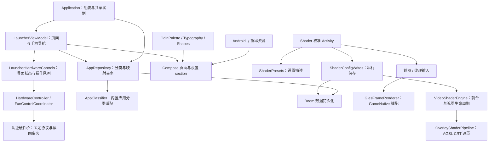

# 架构审计与首版扩展接口

本轮以 `763ff15` 为审计起点。范围是应用源码、资源、Gradle 配置、硬件桥协议及现有回归脚本；采用图谱 Tier 2 查询，并核对实际源码。Shader 文件的图谱解析缺口集中在精度声明，已直接读取。图谱调用关系包含启发式匹配，因此结论以源码为准。本轮包含审计修复，不是仅提出改造计划。

当前支持中文、英文和日文，并在 CONFIG 中选择语言；详见 [多语言说明](languages.md)。皮肤、更多 Shader 和第三方适配先留可用接口。保留单个 `:app` Gradle 模块，以包和实际调用接口隔离职责，暂不引入插件 APK、动态代码加载或资源包安装器。

## 已修复的问题

| 问题与触发条件 | 改动与结果 |
| --- | --- |
| 用 `name == "全部应用"` 判定分类内容、可删除性和应用管理行为，名称变化会改变功能 | `TabEntity.kind` 保存稳定身份；`usesDefaultName` 控制本地化显示。界面、导航和管理动作都按类型判断 |
| UI、通知、磁贴和错误提示直接写中文，只有极少数 XML 字符串 | 英文作为完整默认资源，中文位于 `values-b+zh+Hans` / `values-b+zh+Hant`，日文位于 `values-ja`；CONFIG 通过 AndroidX 应用语言 API 切换，界面、通知与磁贴读取对应资源；注册系统应用语言列表 |
| Room 回调先写分类，仓库的“空表才初始化”路径随后跳过默认应用填充 | 种子分类与首次应用映射统一由仓库事务创建；已有分类不会被反复填充，用户移除应用后保持其选择 |
| 保护默认分类仅依赖 UI 快照；过期操作可以删除新默认项，失效目标可清空默认项 | DAO 在执行时检查当前默认项和全集类型，设置默认项前确认目标存在；排序事务使用数据库中的最新行 |
| 数据库单例在锁内未复查实例 | 增加锁内检查，避免并发首次访问生成第二个实例 |
| LauncherViewModel 混合导航、硬件通知、写入队列与状态校正 | 提取 `LauncherHardwareControls`，由 ViewModel 的协程作用域持有；保留立即显示、按类型合并、请求版本校验、失败校正和注销逻辑 |
| 摇杆灯颜色和开关共用 `lightJob`，连续操作可能相互取消 | 分离颜色与开关任务，继续共享硬件互斥锁 |
| 设置页、滤镜 Activity 混合大量界面绘制和持久化代码 | 设置页分成独立 section；OSD 控件与保存队列分别放到 `ShaderOsdControls`、`ShaderConfigWrites` |
| 保存/预览/实时路径强制把所选效果家族改为 Vulkan | 保留原有 GameNative 家族；OpenGL CRT 等需要游戏像素的组合继续明确限定为截图预览，不被兼容遮罩替换 |
| 预设识别只比较部分字段，改变缩放或隐藏效果后仍显示原预设名 | `ShaderPresets` 统一稳定 ID、名称资源和设置值；识别时比较完整规范化设置 |
| Canvas 管线被注释为可直接承载 Slang/Vulkan 多 pass | 改为明确的 `OverlayShaderPipeline`；实际 GLES 纹理渲染使用独立 `GlesFrameRenderer<Settings>`，并由现有渲染器实现；去掉未实现且继承错误接口的 Slang 空壳 |
| 遮罩初始化失败仍可能按窗口附着状态报开启；预览渲染失败后无法通过新选择恢复 | 初始化成功后才允许附着；预览在新图片、参数或原画对比操作后允许重试；捕获前台配置读取失败，避免取消整个引擎作用域 |
| “关于”页写死 `v1.0.0`，与构建版本不一致 | 从 `BuildConfig.VERSION_NAME` 读取实际版本 |

## 当前职责与调用关系



`GlesFrameRenderer` 的输入是宿主提供的 GLES 2D 纹理，约定线程、EGL 上下文、坐标方向、颜色空间与释放所有权。它不负责获取第三方游戏帧。`OverlayShaderPipeline` 没有游戏像素输入，不能执行依赖重新采样的任意滤镜。这两个接口应分别演进。

当前 OpenGL/Vulkan 表示 GameNative 算法家族。完整效果仍为 GPU 截图预览；实时兼容路径仅支持无需游戏像素输入的 Vulkan-family CRT 遮罩。新增 Shader 文件不会自动让任意第三方游戏获得实时后处理。

## 预留接口如何继续扩展

| 方向 | 首版落点 | 后续实现的位置 |
| --- | --- | --- |
| 多语言 | 中英日资源、CONFIG 语言选择、语言无关的分类身份；用户名称原样保留 | 新增 `values-*` 资源，并更新 `AppLanguage`、`locales_config.xml` 和 Gradle 语言过滤列表 |
| 皮肤 | `OdinDesktopTheme` 接收调色板、字体与形状，主界面与设置使用语义颜色 | 内置皮肤适配器解析资源后提供这些值；完整布局皮肤另设受控模板接口。校准信号图、硬件 LED 色样和部分专用绘图颜色不应简单当作主题色替换 |
| Shader | 预设描述与渲染接口分离；截图渲染可注入 renderer factory | 首先把另一套真实效果作为内置适配接入；届时定义带版本、输入要求、pass、参数和来源许可的资源描述。未知版本和不支持的输入必须报告不兼容 |
| 第三方应用适配 | `AppClassifier` 接收已安装应用的事实数据；仓库不再包含散落的模拟器识别规则 | 替换或组合随 APK 发布的分类适配。启动参数、游戏识别等出现第二套真实实现时，再抽取对应接口 |
| 其他硬件 | UI 控制与现有 Odin 硬件事务分开 | 新设备先实现能力探测和设备适配，沿用成功读回及失败恢复约定；不把当前厂商设置键直接开放成资源包命令 |

扩展资源的稳定 ID 应与展示语言、列表顺序分离；用户选择和第三方参数需具有版本与缺失资源回退规则。首版没有包安装、卸载、热更新或任意参数动态表单，这些不作为现有能力宣传。

## 数据迁移与验证

数据库升级到 4，增加 `kind` 和 `usesDefaultName`，保存 schema 到 `app/schemas/`。旧行的 ID、名称、排序、默认项、游戏分类标记、应用映射和 `effectsJson` 均保留。已知初始种子 ID 与原名称匹配时启用本地化默认名称；用户自建的同名分类不会被强制翻译。原来依靠“全部应用”名称获得的全集行为迁移为稳定类型。

没有破坏性迁移兜底。不能将新数据库直接交给旧版 APK；回退仍需先备份当前状态，再配套恢复旧 APK 与其兼容数据库。实机升级前的备份和验收按 [开发与设备验证](development.md) 执行。

本地检查：

```sh
python3 tools/architecture-regression.py
python3 tools/fan-policy/test.py
python3 tools/cooling-ui-regression.py
python3 tools/home-back-regression.py
python3 tools/fan-state-completion-regression.py
./gradlew :app:assembleDebug :app:assembleRelease :app:lintDebug
```

架构回归执行实际迁移 SQL，并与 Room 导出的 schema 比较；它还编译实际 Kotlin 分类和预设代码，验证语言切换不改变分类身份、改名不改变全集保护、需帧输入的效果分类和完整预设匹配。资源检查核对三种语言的 key 与格式参数。该 JVM 验证使用 Android 类型替身，未验证 Android 渲染、Room 运行时迁移回调和 JSON codec。

首次架构审计的验证结果（多语言后续结果见 [多语言说明](languages.md)）：Debug 和 Release 构建通过；Lint 为 0 个错误、60 个警告。警告主要涉及依赖版本、旧版本兼容判断、专用掌机固定横屏以及未使用资源等。`dispatchKeyEvent` 的 AndroidX Core 1.13.1 基类限制，以及 API 29–33 的磁贴 Intent 重载，均已核对依赖与版本分支后作局部说明；没有建立整库 Lint baseline。两种语言各 333 个字符串 key 校验通过；迁移、DAO 保护、预设与输入要求、91 项风扇协调器检查、高频 Home/Back、风扇完成通知和 9 组硬件 UI 回归通过，其中新增了灯光颜色/开关两种输入顺序的保留测试。

设备重连后需验证：中英日桌面/设置/OSD 的实际布局、长应用名及用户自定义分类名、切语言后的通知和磁贴；旧安装覆盖升级后的分类和排序；已有 Home/Back 与风扇自动策略待验项。使用相同 sRGB 基准图复验 GPU 截图效果与原画对比。本轮没有连接设备，因此本地构建和回归不等于完成这些验收。

实际发行还需沿用 [硬件桥说明](../tools/hardware-bridge/README.md) 中的配对范围：目前管理脚本依赖 debuggable 应用的 `run-as`，正式 Release 的配对方案尚未实现。第三方 Shader 的来源与许可分别见 [来源说明](../THIRD_PARTY_NOTICES.md)，仓库目前没有第一方代码的统一 LICENSE 文本；本轮不改变第三方许可证。

设计参考：[Android 本地化资源](https://developer.android.com/guide/topics/resources/localization)、[Compose 自定义设计系统](https://developer.android.com/develop/ui/compose/designsystems/custom)、[AGSL](https://developer.android.com/develop/ui/views/graphics/agsl)。
