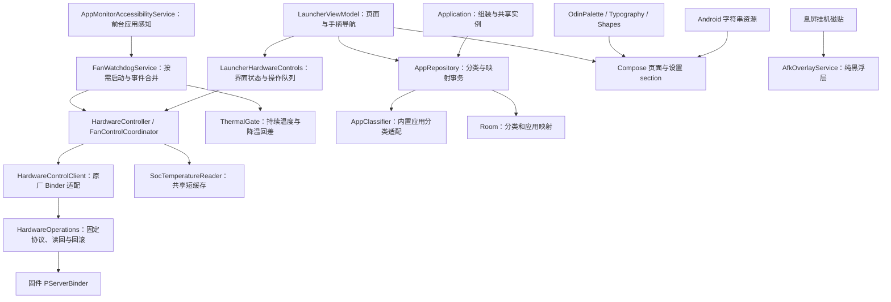

# 应用架构

当前保持单个 `:app` Gradle 模块，以包和实际调用接口隔离桌面、数据、硬件和后台服务。支持中文、英文和日文，语言选择见 [多语言说明](languages.md)。0.1.2 按用户要求完整移除 Shader，包含校准、截图预览、遮罩和渲染接口，见 [移除说明](shader-removal.md)。

## 职责与调用关系



桌面通过 Android `MAIN` / `HOME` / `DEFAULT` 注册，由用户选择默认桌面；开机广播只按策略恢复温控服务，不主动启动界面。Dashboard 保留文件管理、系统设置、Odin 设置三个入口，底部五项硬件控制和顶部电池/风扇区域保留。

风扇仍需要前台应用感知，息屏挂机仍需要悬浮窗权限。因此删除 Shader 时保留无障碍监控、风扇守护和挂机服务。手动硬件操作不要求常驻前台服务；自动温控和挂机的服务按需运行。桌面不可见时停止顶部与仪表盘采样。

## 数据与升级

Room 数据库版本为 5，只包含 `tabs`、`app_mappings` 两个业务表。保留 1→2→3→4 的历史迁移链；4→5 只删除退役的 `app_shader_configs`。旧分类 ID、名称、类型、排序、默认项、游戏标记、图标与应用映射、自定义名称、隐藏标记和自增序列都保留。版本 4 引入的 `kind` / `usesDefaultName` 继续将分类身份与翻译分开。

没有破坏性迁移兜底。新版数据库不能直接交给旧版 APK；不要通过清数据绕过不兼容升级。设备覆盖安装使用同一签名，具体步骤见 [开发与设备验证](development.md)。

`DatabaseMigrationTest` 从独立保存的旧版 schema 创建实际 SQLite 数据库，交给 Room 执行迁移及结构校验；覆盖格式损坏的旧滤镜配置、用户分类和名称保留、自增序列以及全新安装。架构脚本另跑实际 3→4→5 SQL、DAO 保护条件、语言和分类契约，并检查 HOME 注册与共享服务声明。

## 扩展边界

| 方向 | 现有边界 | 后续扩展位置 |
| --- | --- | --- |
| 多语言 | Android 字符串资源与语言无关的分类身份 | 增加语言资源，并更新 `AppLanguage`、`locales_config.xml` 和 Gradle 语言过滤列表 |
| 皮肤 | `OdinDesktopTheme` 的调色板、字体与形状 | 内置主题适配；硬件 LED 色样等专用颜色保留实际含义 |
| 第三方应用 | `AppClassifier` 接收已安装应用的事实数据 | 随 APK 发布分类适配；有第二套真实实现时再提取新接口 |
| 其他硬件 | UI 状态和 Odin 固定硬件事务分离 | 增加能力探测与设备适配，沿用成功读回、失败恢复约定 |

不包含插件 APK、动态代码加载或游戏画面注入。Debug / Release 使用相同原厂硬件适配，旧桥保留作开发诊断；接口与固件边界见 [接入记录](hardware-standalone-investigation.md)。旧版 Shader 的来源和许可记录见 [第三方说明](../THIRD_PARTY_NOTICES.md)。仓库尚未包含第一方代码的统一 LICENSE 文本。

## 验证入口

```sh
tools/android ./gradlew :app:assembleDebug :app:assembleRelease :app:testDebugUnitTest :app:lintDebug
tools/android python3 tools/architecture-regression.py
tools/android python3 tools/fan-policy/test.py
tools/android python3 tools/cooling-ui-regression.py
tools/android python3 tools/home-back-regression.py
tools/android python3 tools/fan-state-completion-regression.py
```

本地构建、Robolectric 和替身回归不能代替实机 UI、固件控制及温控验收。此前审计与设备记录保留在 [优化验收](optimization-audit.md) 和 [修复交接](performance-fan-home-fixes.md)，其中 Shader 部分仅描述旧版。
