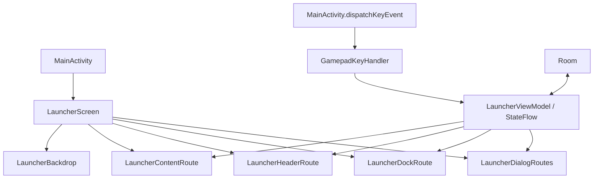

# 控制台界面架构

本文记录当前启动器界面的组合边界、矢量背景绘制方式、省电暂停条件和验收入口。业务状态、设备输入与持久化仍由既有 ViewModel、MainActivity 和 Room 负责。

## 组合边界

`LauncherScreen` 保持 MainActivity 使用的公开入口。它负责屏幕装配、方向副作用和背景层，不接管业务状态或按键分发。



各路由只收集自己显示所需的状态。`collectAsVisibleState` 使用 `repeatOnLifecycle(STARTED)`。Dashboard 状态不会由 Dock 持有；硬件读数不会由应用网格持有。关闭的弹窗只收集各自的打开状态，其余数据在弹窗打开后才订阅。

Dashboard 内容区直接从统计卡片开始，不显示重复的 H1 页面标题。顶部导航保留 Dashboard 名称。LR 切入时不会再创建内容区的“仪表盘”大标题，也不预留空标题行。

`AppIconCollection` 保持应用条带、全屏网格、`[+]` 入口、焦点滚动和拖拽排序的现有职责。Y 键、D-pad、A/B、肩键仍由 `MainActivity.dispatchKeyEvent` 转交 `GamepadKeyHandler` 与 ViewModel 处理。此次 UI 拆分不改变 Room 数据、导航状态或 MainActivity 的入口 API。

应用扫描在现有 IO 协程中将支持的静态图标准备为最长边不超过 256 px 的透明位图，并调用 `prepareToDraw()` 提前提交上传。准备过程保留宽高比和原图标边界，小位图不放大；动画、状态相关及未知类型保留原 Drawable，单个图标准备失败时也回退原图标。图标卡片通过 `AndroidView.onReset` 复用离屏的 `ImageView`，复用和释放时清空旧图标。普通条带的前 10 个应用列表按应用数据和布局模式缓存，方向键移动焦点时复用该列表。

条带仍将焦点图标平滑滚向中央。在列表首尾，若目标已居中或请求的方向已无可滚动空间，就跳过无法移动的滚动动画。焦点、触摸拖拽、网格滚动和返回来源位置的规则保持不变。分类计算移到后台；进入手动排序会取消旧计算，计算期间被用户替换的列表也不会被旧结果覆盖。

## 动态背景与暂停边界

v0.1.25 背景使用 Canvas 绘制深蓝至靛色的淡纵向渐变和静态径向柔光。动态部分由两条缓存的 Path 构成：一条宽幅主面和一条较淡的伴带。主面中央上下边界的间隙约为 0.17H，随后向两侧展开。主面以内部渐变表现面光影；没有第三条折面，也没有描线。Path 和 Brush 在 `drawWithCache` 中按绘制区域尺寸和调色板创建；每帧只读取相位并绘制，不重置或重建几何。

两条 Path 在同一绘制变换中运动，因此全幅同相。运动使用 24 秒正弦周期，更新间隔为 50 ms，上限为 20 次/秒。令 `s = sin(2πphase)`，平移量为 `x = 0.024W·s`、`y = 0.045H·s`；缩放量为 `scaleX = 1 + 0.009s`、`scaleY = 1 + 0.008s`。在转向点速度为零、加速度非零，整周期连续。相位只在绘制阶段读取，因此更新不会让界面组合树重新执行。聚焦边框仍由共享组件绘制三层浅蓝白半透明矢量描边，形成轻微软 halo；没有使用真实模糊滤镜。以上是实现参数，不代表帧率、功耗或续航实测结果。

动画必须同时满足以下条件：界面请求动态效果、Activity 处于 `RESUMED`、窗口有焦点、绘制 View 已附着、系统省电模式关闭、系统动画倍率大于 0。配置、应用操作、批量管理或排序弹窗打开时，以及应用图标重排时，启动器会关闭背景运动。恢复后保留原相位，不累计隐藏期间的时间。

背景是内容后方的装饰层。它不接收按键或指针输入，也不占用导航焦点。页面切换、弹窗、焦点和拖动行为仍由前景组件负责。

## 回归与设备验收

本地回归命令：

```sh
tools/android ./gradlew :app:testDebugUnitTest
tools/android python3 tools/architecture-regression.py
tools/android python3 tools/home-back-regression.py
```

`BackgroundMotionTest` 检查每个暂停门、暂停后相位保持、正弦往复的端点与中心，以及时钟按实际帧时间推进和循环；v0.1.25 背景测试 6/6 通过。单元测试与架构脚本不能证明实机绘制、功耗、续航或触控拖拽体验。

设备验收应在确认 ADB 目标后进行，并覆盖：新配色与标题/焦点的可读性；Dashboard、应用主页、全部应用和设置弹窗；D-pad 导航、触控滚动、图标拖拽和排序；锁屏、失焦、省电模式与系统动画倍率关闭时背景停止；恢复后动画从原位置继续。验收时记录设备型号、固件、分辨率、字体倍率及观察结果。

2026-10-03，v0.1.25 和 v0.1.26 已正式发布并保留数据安装到 AYN Odin3 / Android 15。v0.1.26 将缓存半透明渐变、高光与细边的玻璃材质统一应用于图片槽、内容容器、控件与输入框、徽标、聚焦导航和模态遮罩；它不是真实 backdrop blur。84 项单测、8 项共享检查和六组 UI Kit 原生尺寸测量通过。正式版有效的 12 秒 HWUI 窗口样本为 208 帧、0 个 janky frame，分位数均为 5 ms；该整窗数据不能分离材质开销，也不能说明功耗或长时续航。五张完整应用英文原生截图已从正式 APK 拍摄、检查并原样复制到文档目录。Library 的 Back 返回 All apps 原位置；Orientation 设置页的 Back 也返回同一来源页。设备语言随后恢复为 zh-Hans、字体倍率为 1.0。用户整体视觉反馈和长时性能结果仍待完成。发布、安装、截图、组件测量和性能边界见 [v0.1.26 记录](releases.md#v0126-正式发布与安装)。

### 参考与设计取舍

[Libretro 的 XMB 文档](https://docs.libretro.com/guides/xmb/)称其默认壁纸为 PlayStation 风格动态丝带；[公开 fragment shader](https://raw.githubusercontent.com/libretro/RetroArch/master/gfx/drivers/gl_shaders/pipeline_xmb_ribbon.glsl.frag.h)基于表面法线计算明暗。[Sony 的 PS5 设计说明](https://www.sony.com/en/SonyInfo/design/stories/PS5/)提到 Control Center 与 Game Help 使用克制、中性的 UI，以免干扰游戏。这些资料只作方向参考。

[Adam Oestergaard 在其项目页的自述](https://www.adamoe.com/work/sonyux)称，他曾与 Sony Design Center 和 global Central Design 团队合作两年，共同设计 Genome 等 UX 概念，并参与原始 PS4 UI/UX 的早期概念工作；他还称 ribbon 概念后来被其他团队采用并进入 PS4、Vaio 产品。该页面说明的是作者参与经历，不表示他独自设计了量产 PS4 界面，也没有公开 Sony 动画算法。

结合用户提供的 PS4 丝带参考，本项目的设计推断是：使用少量宽面、留出大块空白，以面内渐变表现光影，并让两条丝带同步运动。此设计不是对 Sony 动画算法的复刻，也不复制 Libretro 的 GPL shader 源码。

本轮 Lint 修复、保留原因和依赖升级建议见 [警告处理](lint-review.md)。
