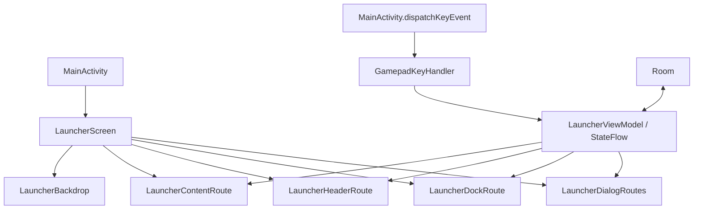

# 控制台界面架构

本文记录当前启动器界面的组合边界、矢量背景绘制方式、省电暂停条件和验收入口。业务状态、设备输入与持久化仍由既有 ViewModel、MainActivity 和 Room 负责。

## 组合边界

`LauncherScreen` 保持 MainActivity 使用的公开入口。它负责屏幕装配、方向副作用和背景层，不接管业务状态或按键分发。



各路由只收集自己显示所需的状态。`collectAsVisibleState` 使用 `repeatOnLifecycle(STARTED)`。Dashboard 状态不会由 Dock 持有；硬件读数不会由应用网格持有。关闭的弹窗只收集各自的打开状态，其余数据在弹窗打开后才订阅。

`AppIconCollection` 保持应用条带、全屏网格、`[+]` 入口、焦点滚动和拖拽排序的现有职责。Y 键、D-pad、A/B、肩键仍由 `MainActivity.dispatchKeyEvent` 转交 `GamepadKeyHandler` 与 ViewModel 处理。此次 UI 拆分不改变 Room 数据、导航状态或 MainActivity 的入口 API。

## 动态背景与暂停边界

`ConsoleBackground` 使用 Canvas 绘制深蓝底色和四层 Bezier 曲线带。尺寸变化时 `drawWithCache` 创建路径和渐变笔刷；每帧只平移已缓存路径。动画 phase 只在绘制阶段读取，所以相位更新不会让界面组合树重新执行。

默认相位更新间隔为 50 ms，目标上限为 20 次/秒，完整周期为 48 秒。这里描述的是实现参数，不代表设备功耗或帧率测量结果。

动画必须同时满足以下条件：界面请求动态效果、Activity 处于 `RESUMED`、窗口有焦点、绘制 View 已附着、系统省电模式关闭、系统动画倍率大于 0。配置、应用操作、批量管理或排序弹窗打开时，以及应用图标重排时，启动器会关闭背景运动。恢复后保留原相位，不累计隐藏期间的时间。

背景是内容后方的装饰层。它不接收按键或指针输入，也不占用导航焦点。页面切换、弹窗、焦点和拖动行为仍由前景组件负责。

## 回归与设备验收

本地回归命令：

```sh
tools/android ./gradlew :app:testDebugUnitTest
tools/android python3 tools/architecture-regression.py
tools/android python3 tools/home-back-regression.py
```

`BackgroundMotionTest` 检查每个暂停门、暂停后相位保持，以及时钟按实际帧时间推进和循环。单元测试与架构脚本不能证明实机绘制、功耗、续航或触控拖拽体验。

设备验收应在确认 ADB 目标后进行，并覆盖：新配色与标题/焦点的可读性；Dashboard、应用主页、全部应用和设置弹窗；D-pad 导航、触控滚动、图标拖拽和排序；锁屏、失焦、省电模式与系统动画倍率关闭时背景停止；恢复后动画从原位置继续。验收时记录设备型号、固件、分辨率、字体倍率及观察结果。

本次文档更新时没有可用的 ADB 实机数据。因此，视觉、续航、实际功耗和触控拖拽表现仍未验证；不据此宣称最低功耗或性能最优。

本轮 Lint 修复、保留原因和依赖升级建议见 [警告处理](lint-review.md)。
